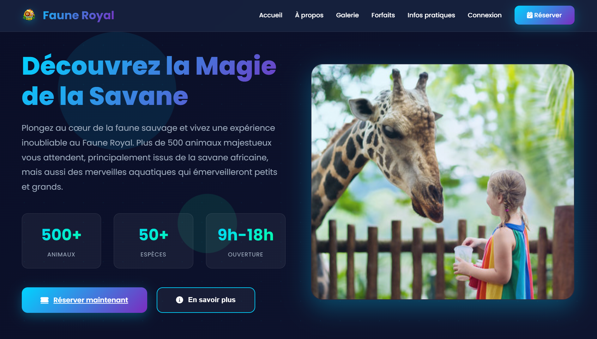
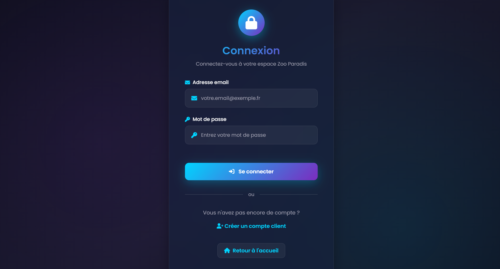
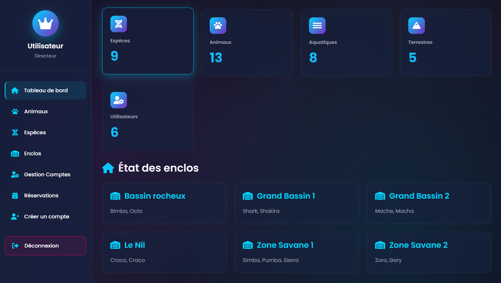
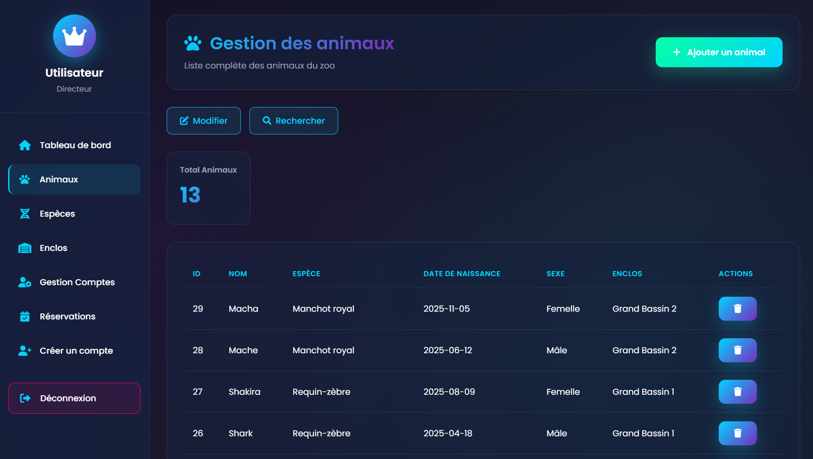
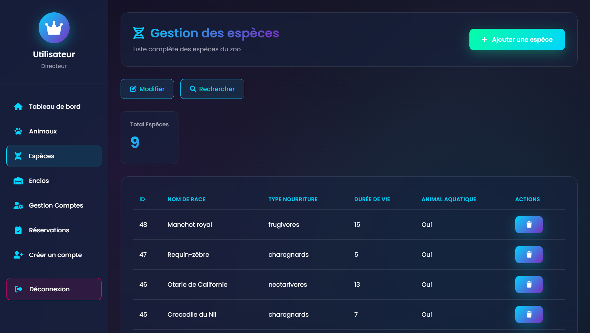
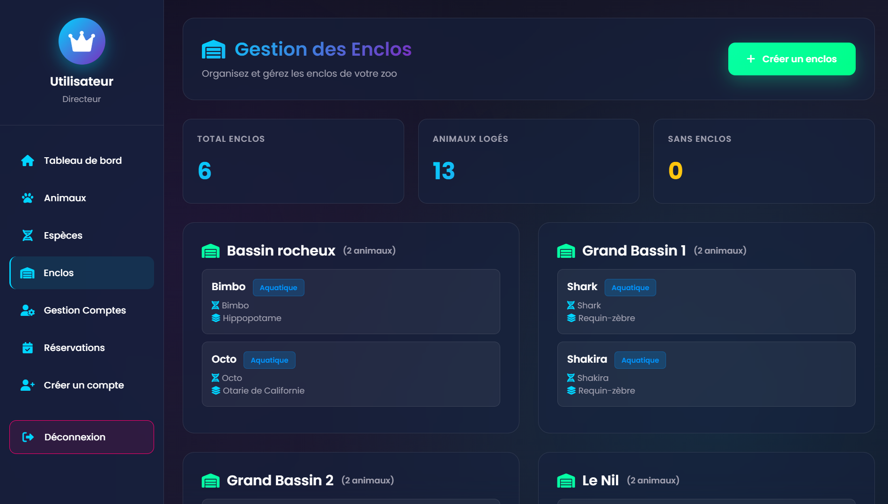
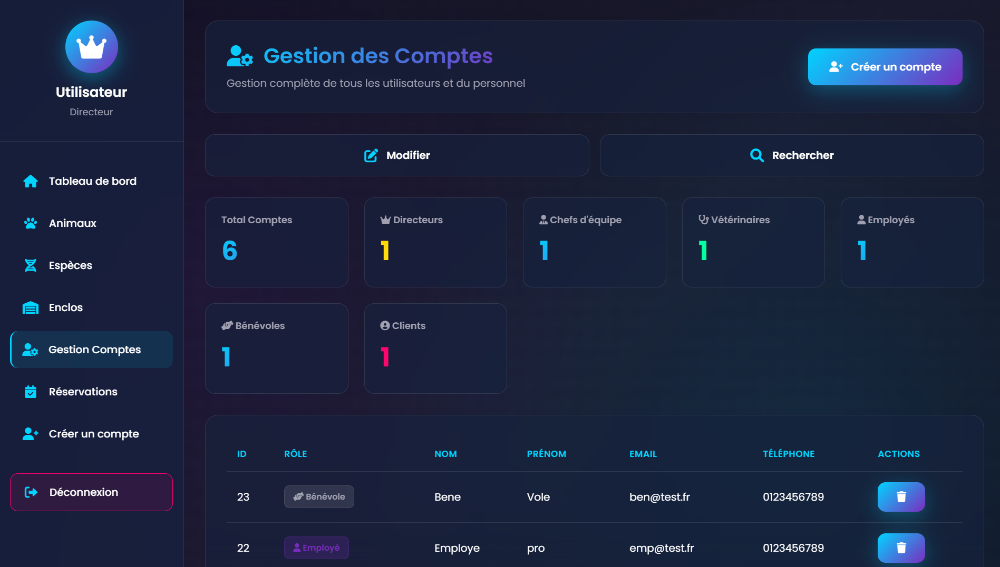
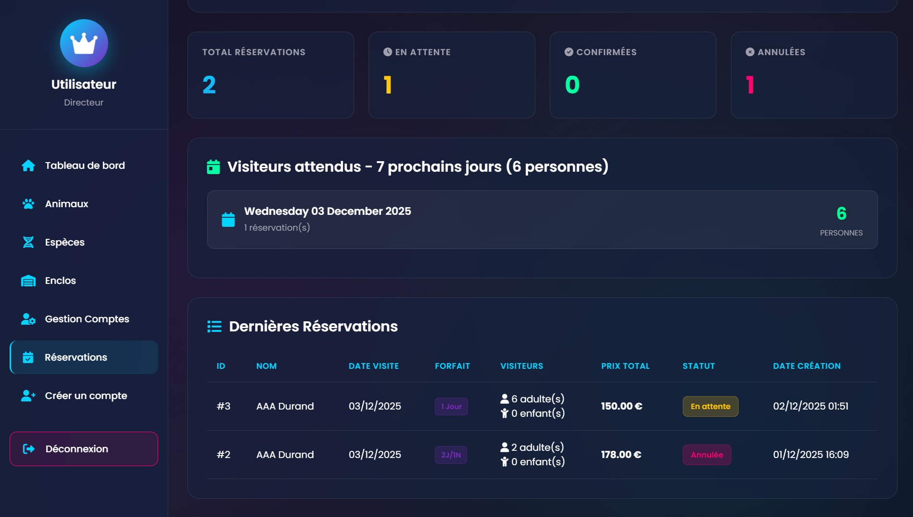
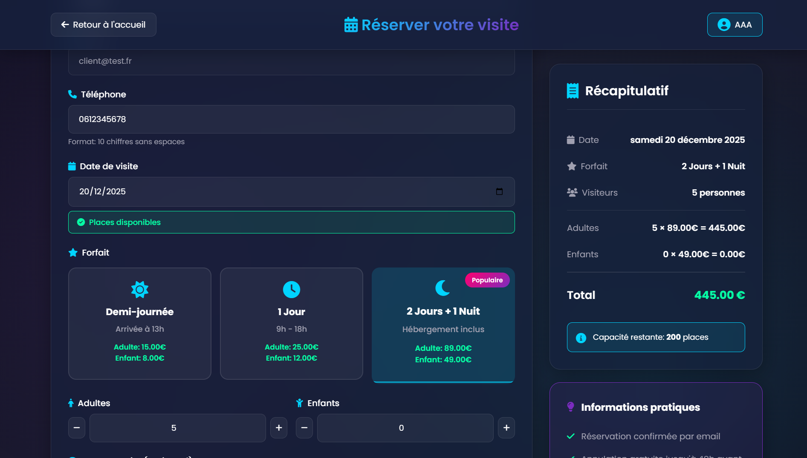
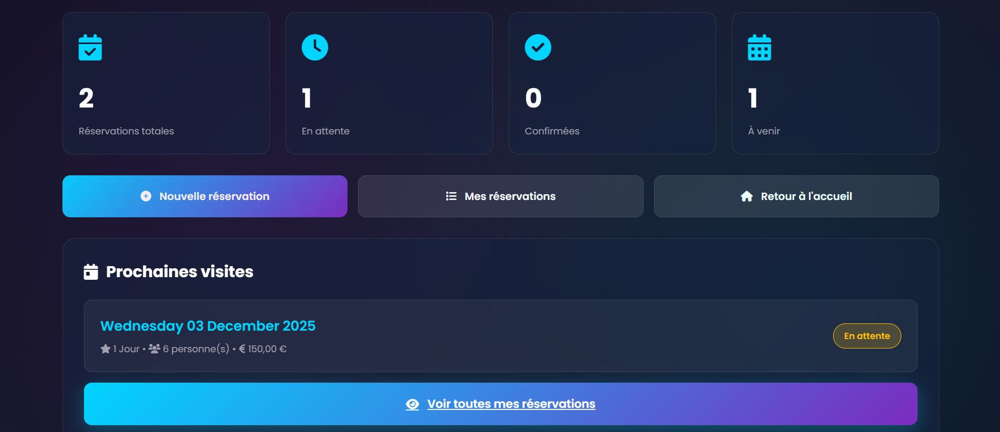

<div align="center">

# 🦁 Faune Royale - Système de Gestion Futuriste


### 🎓 Projet E6 - BTS SIO SLAM
### Développé par [@akoflux](https://github.com/akoflux)

---

**Une application web moderne de gestion de zoo avec système multi-rôles**
*Architecture client léger • Design futuriste • Sécurité renforcée*

[📸 Voir les captures](#-captures-décran) • [🚀 Installation](#-installation) • [📖 Documentation](#-documentation) • [🔒 Sécurité](#-sécurité)

</div>

---

## 🌟 Présentation

**Zoo Paradis** est une application web complète de gestion de zoo développée dans le cadre de l'épreuve E6 du BTS SIO. Elle permet la gestion des animaux, des espèces, des enclos, du personnel et des réservations clients avec une interface moderne et intuitive.

### 🎯 Objectifs pédagogiques

- ✅ Développement d'une application web sécurisée (SLAM)
- ✅ Mise en œuvre d'une architecture MVC adaptée
- ✅ Gestion des rôles et permissions (RBAC)
- ✅ Protection contre les vulnérabilités OWASP
- ✅ Interface utilisateur moderne et responsive

---

## ✨ Fonctionnalités principales

### 👥 Système multi-rôles

```
┌─────────────────────────────────────────────────────────────┐
│                                                             │
│  🏛️  DIRECTEUR     → Accès complet + gestion réservations  │
│  👔  CHEF D'ÉQUIPE → Gestion animaux, espèces, enclos      │
│  👨‍⚕️  VÉTÉRINAIRE   → Gestion animaux et espèces            │
│  👷  EMPLOYÉ       → Gestion animaux et espèces            │
│  🤝  BÉNÉVOLE      → Consultation uniquement               │
│  🎫  CLIENT        → Réservations et suivi                 │
│                                                             │
└─────────────────────────────────────────────────────────────┘
```

### 🔐 Sécurité renforcée

- **Protection CSRF** : Tokens de sécurité sur tous les formulaires
- **SQL Injection** : Requêtes préparées (Prepared Statements)
- **XSS Protection** : Échappement systématique avec `htmlspecialchars()`
- **Authentification** : Sessions sécurisées avec contrôle d'accès
- **Validation** : Vérification stricte des données utilisateur
- **Logging** : Traçabilité de toutes les actions importantes

### 🦁 Gestion des animaux

- Ajout, modification, suppression d'animaux
- Attribution aux enclos
- Association aux espèces
- Suivi détaillé par rôle
- Dashboard avec statistiques

### 🧬 Gestion des espèces

- Création d'espèces (aquatiques/terrestres)
- Type de nourriture
- Durée de vie moyenne
- Informations complémentaires
- Vérification des doublons

### 🏠 Gestion des enclos

- Création et suppression d'enclos
- Affichage dynamique sur les dashboards
- Vérification avant suppression (pas d'animaux assignés)
- Vue d'ensemble en temps réel

### 📅 Système de réservations

- Réservation en ligne pour les clients
- 3 forfaits disponibles :
  - 🌅 Demi-journée (13h-18h)
  - ☀️ 1 Jour (9h-18h)
  - 🌙 2 Jours + 1 Nuit
- Calcul automatique des prix
- Gestion des statuts (en attente, confirmée, annulée)
- Annulation par le client
- Dashboard administrateur

### 📊 Tableaux de bord interactifs

- Vue d'ensemble avec statistiques en temps réel
- Graphiques et compteurs animés
- Affichage des enclos avec leurs animaux
- Design futuriste avec effets visuels

---

## 🎨 Captures d'écran

> 💡 **Note**: Placez vos captures d'écran dans le dossier `docs/screenshots/`

### 🏠 Page d'accueil

*Interface d'accueil moderne avec animations futuristes*

### 🔐 Connexion & Inscription

*Système d'authentification sécurisé avec validation en temps réel*

### 📊 Dashboard Direction

*Vue complète pour le directeur avec toutes les statistiques*

### 🦁 Gestion des animaux

*Interface de gestion des animaux avec filtres et recherche*

### 🧬 Gestion des espèces

*Création et modification d'espèces avec validation*

### 🏠 Gestion des enclos

*Vue d'ensemble des enclos avec affichage dynamique*

### 🎓 Gestion Utilisateurs

*Vue d'ensemble des utilisateurs*

### 📋 Gestion Réservation

*Vue d'ensemble des réservations*

### 🎫 Réservations clients

*Interface de réservation intuitive avec sélection de forfaits*

### 👤 Espace client

*Dashboard client avec suivi des réservations*

---

## 🛠️ Technologies utilisées

### Backend
- **PHP 8.0+** - Langage serveur
- **MySQL 8.0** - Base de données relationnelle
- **MySQLi** - Extension PHP pour MySQL avec prepared statements

### Frontend
- **HTML5** - Structure sémantique
- **CSS3** - Styles modernes (Gradients, Animations, Backdrop Filter)
- **JavaScript** - Interactions dynamiques
- **Font Awesome 6** - Icônes vectorielles
- **Google Fonts (Poppins)** - Typographie moderne

### Sécurité
- Sessions PHP sécurisées
- Tokens CSRF
- Prepared Statements (SQL Injection)
- htmlspecialchars() (XSS)
- Validation côté serveur

### Design
- Architecture MVC adaptée
- Design responsive (mobile-first)
- Thème futuriste avec effets glassmorphism
- Animations CSS3
- Palette de couleurs cohérente

---

## 🚀 Installation

### Prérequis

```bash
- XAMPP 8.0+ (ou WAMP/MAMP)
- PHP 8.0 minimum
- MySQL 8.0
- Navigateur moderne (Chrome, Firefox, Edge)
```

### Étapes d'installation

#### 1️⃣ Cloner le repository

```bash
git clone https://github.com/akoflux/zoo-paradis.git
cd zoo-paradis
```

#### 2️⃣ Déplacer les fichiers

```bash
# Sous Windows (XAMPP)
Copier le dossier dans: C:\xampp\htdocs\ProjetZoo

# Sous Linux/Mac
Copier le dossier dans: /opt/lampp/htdocs/ProjetZoo
```

#### 3️⃣ Créer la base de données

1. Démarrer **Apache** et **MySQL** depuis XAMPP Control Panel
2. Ouvrir **phpMyAdmin** : [http://localhost/phpmyadmin](http://localhost/phpmyadmin)
3. Créer une nouvelle base de données nommée `zoo_paradis`
4. Importer le fichier SQL :
   - Cliquer sur "Importer"
   - Sélectionner `database/zoo_paradis.sql`
   - Cliquer sur "Exécuter"

#### 4️⃣ Configurer la connexion

Modifier le fichier `connexion.php` si nécessaire :

```php
<?php
$servername = "localhost";
$username = "root";
$password = "";  // Mot de passe MySQL (vide par défaut sur XAMPP)
$dbname = "zoo_paradis";

$conn = mysqli_connect($servername, $username, $password, $dbname);
?>
```

#### 5️⃣ Accéder à l'application

Ouvrir votre navigateur et aller sur :
```
http://localhost/ProjetZoo/
```

---

## 👥 Comptes de test

Pour tester l'application avec les différents rôles :

| Rôle | Email | Mot de passe | Permissions |
|------|-------|--------------|-------------|
| 🏛️ **Directeur** | `admin@test.fr` | `password123` | Accès complet |
| 👔 **Chef d'équipe** | `ce@test.fr` | `password123` | Gestion complète sauf réservations |
| 👨‍⚕️ **Vétérinaire** | `veto@test.fr` | `password123` | Animaux + Espèces |
| 👷 **Employé** | `emp@test.fr` | `password123` | Animaux + Espèces |
| 🤝 **Bénévole** | `ben@test.fr` | `password123` | Consultation uniquement |
| 🎫 **Client** | `client@test.com` | `12345678` | Réservations |

> ⚠️ **Important** : Changez ces mots de passe en production !

---

## 📁 Structure du projet

```
ProjetZoo/
├── 📄 index.html                    # Page d'accueil
├── 📄 connexion.php                 # Configuration BDD
├── 📄 global-futuriste.css          # Styles globaux
│
├── 📁 includes/                     # Fichiers communs
│   ├── auth.php                     # Gestion authentification
│   ├── roles.php                    # Gestion des permissions
│   └── csrf.php                     # Protection CSRF
│
├── 📁 Connexion/                    # Authentification
│   ├── connexion.php                # Formulaire connexion
│   ├── traitement_connexion.php     # Traitement connexion
│   └── deconnexion.php              # Déconnexion
│
├── 📁 Inscription/                  # Inscription clients
│   ├── inscription.php              # Formulaire inscription
│   └── traitement_inscription.php   # Traitement inscription
│
├── 📁 Direction/                    # Interface directeur
│   ├── main.php                     # Dashboard principal
│   ├── 📁 animaux/                  # Gestion animaux
│   ├── 📁 especes/                  # Gestion espèces
│   ├── 📁 enclos/                   # Gestion enclos
│   ├── 📁 user/                     # Gestion utilisateurs
│   ├── 📁 reservations/             # Gestion réservations
│   └── 📁 gestion_comptes/          # Création comptes staff
│
├── 📁 Employes/                     # Interface employés
│   ├── main.php                     # Dashboard employés
│   ├── 📁 animaux/                  # Gestion animaux
│   └── 📁 especes/                  # Gestion espèces
│
├── 📁 Veterinaire/                  # Interface vétérinaire
│   └── main.php                     # Dashboard vétérinaire
│
├── 📁 Benevole/                     # Interface bénévole
│   └── main.php                     # Dashboard bénévole
│
├── 📁 Client/                       # Interface client
│   ├── main.php                     # Dashboard client
│   ├── reservations.php             # Liste réservations
│   └── annuler_reservation.php      # Annulation réservation
│
├── 📁 Reservation/                  # Système réservation
│   ├── reservation.php              # Formulaire réservation
│   ├── traitement_reservation.php   # Traitement réservation
│   ├── check_disponibilite.php      # Vérification dispo
│   └── confirmation.php             # Confirmation réservation
│
├── 📁 Images/                       # Ressources images
├── 📁 database/                     # Scripts SQL
│   └── zoo_paradis.sql              # Structure + données
│
└── 📄 README.md                     # Ce fichier
```

---

## 🔒 Sécurité

### Mesures de sécurité implémentées

#### 1. Protection contre l'injection SQL
```php
// ✅ Utilisation de requêtes préparées
$stmt = mysqli_prepare($conn, "SELECT * FROM users WHERE email = ?");
mysqli_stmt_bind_param($stmt, "s", $email);
mysqli_stmt_execute($stmt);
```

#### 2. Protection contre les attaques XSS
```php
// ✅ Échappement des données affichées
echo htmlspecialchars($user_input, ENT_QUOTES, 'UTF-8');
```

#### 3. Protection CSRF
```php
// ✅ Génération de tokens
$_SESSION['csrf_token'] = bin2hex(random_bytes(32));

// ✅ Vérification
if ($_POST['csrf_token'] !== $_SESSION['csrf_token']) {
    die("Token CSRF invalide");
}
```

#### 4. Gestion des sessions
```php
// ✅ Configuration sécurisée
session_start([
    'cookie_httponly' => true,
    'cookie_secure' => true,    // En production avec HTTPS
    'cookie_samesite' => 'Strict'
]);
```

#### 5. Validation des données
```php
// ✅ Validation stricte
$email = filter_var($_POST['email'], FILTER_VALIDATE_EMAIL);
$age = filter_var($_POST['age'], FILTER_VALIDATE_INT);
```

#### 6. Contrôle d'accès (RBAC)
```php
// ✅ Vérification des permissions
require_role(['Directeur', 'Chef_Equipe'], "Accès refusé");
```

#### 7. Logging des activités
```php
// ✅ Traçabilité
log_activite("Suppression animal", "Animaux", "Animal #$id supprimé");
```

### 🛡️ Checklist sécurité

- [x] Requêtes préparées sur toutes les requêtes SQL
- [x] Échappement HTML sur toutes les sorties
- [x] Tokens CSRF sur tous les formulaires
- [x] Validation des données côté serveur
- [x] Contrôle d'accès basé sur les rôles
- [x] Sessions sécurisées
- [x] Logging des actions sensibles
- [x] Mots de passe hashés (bcrypt)
- [x] Protection contre les Directory Traversal
- [x] Vérification des types de fichiers (si upload)

---

## 📖 Documentation technique

### Architecture

Le projet suit une architecture **MVC adaptée** :

- **Modèle** : Interactions avec la base de données (via MySQLi)
- **Vue** : Fichiers PHP avec HTML/CSS intégré
- **Contrôleur** : Fichiers de traitement (`traitement_*.php`)

### Base de données

#### Tables principales

- **`users`** : Utilisateurs et leurs rôles
- **`animaux`** : Données des animaux
- **`especes`** : Espèces avec caractéristiques
- **`enclos`** : Enclos du zoo
- **`reservations`** : Réservations des clients
- **`activites`** : Logs d'activité

#### Schéma relationnel

```sql
users (id, prenom, nom, email, password, role, ...)
  ↓
reservations (id, user_id, date_visite, forfait, ...)

animaux (id, Nom, Sexe, Espece, Enclos, ...)
  ↓
especes (id, nom_race, type_nourriture, animal_aquatique, ...)

enclos (id, Nom, ...)
```

### Système de rôles

Les permissions sont gérées via la fonction `require_role()` :

```php
// Un seul rôle requis
require_role('Directeur', "Message d'erreur");

// Plusieurs rôles autorisés
require_role(['Veterinaire', 'Employe', 'Chef_Equipe'], "Message d'erreur");
```

---

## 🎓 Contexte BTS SIO

### Compétences validées (E6)

#### Bloc 1 : Gestion du patrimoine informatique
- ✅ Installation et configuration d'environnement (XAMPP)
- ✅ Déploiement d'application web

#### Bloc 2 : Réponse aux incidents et demandes
- ✅ Résolution de problèmes techniques
- ✅ Assistance utilisateur

#### Bloc 3 : Développement d'une solution applicative
- ✅ **Conception de l'application** (MVC, diagrammes)
- ✅ **Développement** (PHP, MySQL, JavaScript)
- ✅ **Sécurisation** (OWASP Top 10)
- ✅ **Tests** (validation fonctionnelle)
- ✅ **Documentation** (README, commentaires)

#### Bloc 4 : Gestion des données
- ✅ **Modélisation** (MCD/MLD)
- ✅ **Création de BDD** (MySQL)
- ✅ **Requêtes SQL** (SELECT, INSERT, UPDATE, DELETE)
- ✅ **Optimisation** (Index, requêtes préparées)

### Livrables E6

- [x] Application fonctionnelle
- [x] Base de données normalisée
- [x] Documentation technique
- [x] Sécurité implémentée
- [x] Tests réalisés
- [x] Code commenté

---

## 🚧 Améliorations futures

- [ ] API REST pour mobile
- [ ] Système de notifications en temps réel
- [ ] Module de statistiques avancées avec graphiques
- [ ] Export des données (PDF, Excel)
- [ ] Gestion de planning pour les soigneurs
- [ ] Module de facturation automatique
- [ ] Interface d'administration plus poussée
- [ ] Système de backup automatique
- [ ] Mode sombre/clair
- [ ] Support multilingue

---

## 🤝 Contribution

Les contributions sont les bienvenues ! Pour contribuer :

1. Fork le projet
2. Créer une branche (`git checkout -b feature/nouvelle-fonctionnalite`)
3. Commit les changements (`git commit -m 'Ajout nouvelle fonctionnalité'`)
4. Push vers la branche (`git push origin feature/nouvelle-fonctionnalite`)
5. Ouvrir une Pull Request

---

## 📝 License

Ce projet est sous licence **MIT** - voir le fichier [LICENSE](LICENSE) pour plus de détails.

```
MIT License

Copyright (c) 2024 akoflux

Permission is hereby granted, free of charge, to any person obtaining a copy
of this software and associated documentation files (the "Software"), to deal
in the Software without restriction, including without limitation the rights
to use, copy, modify, merge, publish, distribute, sublicense, and/or sell
copies of the Software, and to permit persons to whom the Software is
furnished to do so, subject to the following conditions:

The above copyright notice and this permission notice shall be included in all
copies or substantial portions of the Software.

THE SOFTWARE IS PROVIDED "AS IS", WITHOUT WARRANTY OF ANY KIND, EXPRESS OR
IMPLIED, INCLUDING BUT NOT LIMITED TO THE WARRANTIES OF MERCHANTABILITY,
FITNESS FOR A PARTICULAR PURPOSE AND NONINFRINGEMENT.
```

---

## 📧 Contact

**Développeur** : akoflux
**GitHub** : [@akoflux](https://github.com/akoflux)
**Projet** : [Zoo Paradis](https://github.com/akoflux/faune-royale)

---

## 🙏 Remerciements

- **BTS SIO** - OPTION SLAM
- **Font Awesome** - Icônes
- **Google Fonts** - Police Poppins
- **XAMPP** - Environnement de développement

---

<div align="center">

### ⭐ N'oubliez pas de mettre une étoile si ce projet vous a été utile !

**Fait avec ❤️ pour le BTS SIO**


---

**Zoo Paradis** © 2024 | Version 1.0.0

</div>

